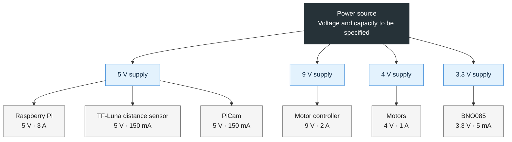

| Component               | Voltage | Current |
| ----------------------- | ------- | ------- |
| Raspberry Pi            | 5 V     | 3 A     |
| Motor controller        | 9 V     | 2 A     |
| Motors                  | 4 V     | 1 A     |
| TF-Luna distance sensor | 5 V     | 150 mA  |
| BnO085                  | 3.3V    | 5mA     |
| PiCam                   | 5V      | 150mA   |

## Power Distribution

This diagram shows the power requirements listed for our Bobotics robot. It is a planning overview, not a wiring diagram: the power source and any voltage regulators still need to be specified.

### Notes

- Voltage and current labels reproduce our recorded values.
- Branches group components by voltage; they do not specify physical connections.
- Confirm whether
